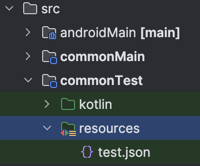

# [Resource](https://kmp.telereso.io/docs/core-test/0.6.1/-core/io.telereso.kmp.core.test/-resource/index.html){:target="_blank"}

Efficiently manage and access static content in your tests with the **Resource** class, designed to simplify loading files from resource directories in Kotlin Multiplatform projects.

## Overview

The **Resource** class provides a convenient way to locate and load static content from files placed in the following path:

`<module>/src/commonTest/resources`

This functionality is compatible across all supported Kotlin Multiplatform targets:

- **JVM**
- **Android**
- **iOS** (including both simulator and host unit tests)
- **JavaScript**
- **WasmJS**

## Adding Resource Files

To use the **Resource** class, place your resource files under:

`<module>/src/commonTest/resources`

For example:



## Using the Resource Class

Here’s how you can access and read content from your resource files:

### Example

```kotlin
val res = Resource("test.json")

// Synchronous reading
val string = res.readText()

// Asynchronous reading
val string = res.readTextTask().await()
```
